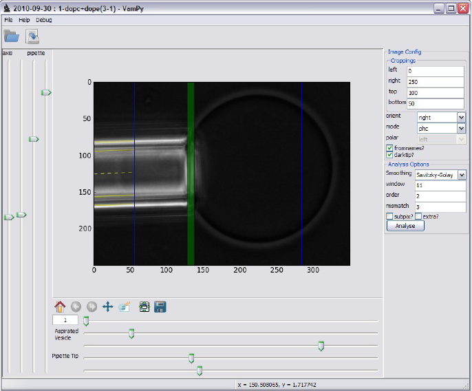

=============================================
VAMPy - Vesicle Aspiration with MicroPipettes
=============================================

Purpose
=======
Analyse images of micropipette vesicle aspiration experiment to extract values for bending rigidity and stretching elasticity of the lipid bilayer membrane.

Screenshot
==========

More info
=========
More information and user manual can be found in ``docs/vampy.pdf``.